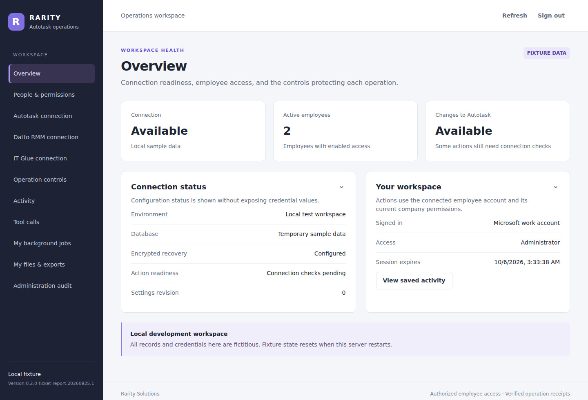
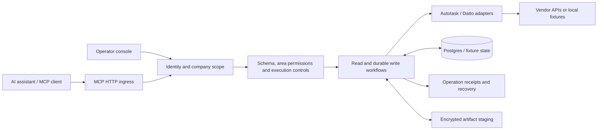
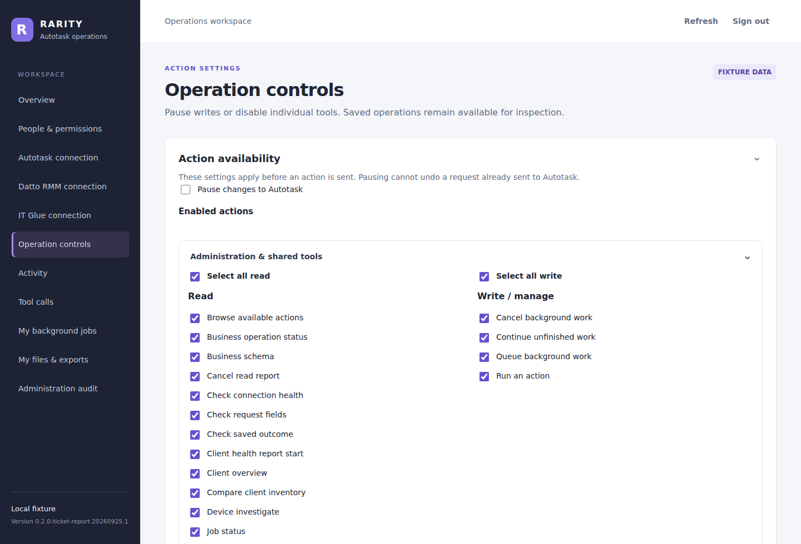

# Rarity Autotask MCP

A self-hosted [Model Context Protocol](https://modelcontextprotocol.io/) server that connects AI assistants to Autotask PSA and Datto RMM. Technicians can find client records, document work, manage tickets and business workflows, and inspect mapped devices through scoped tools. A web console manages Entra identities, permissions, integrations, and operation history.

   



*The implemented console, running locally with fictitious employee and company records. No customer data or live vendor credentials are shown.*

**Status:** active development. The source declares release **`0.2.0-ticket-report.20260925.1`**. This public portfolio snapshot withholds private customer and live-deployment receipts; publishing source does not deploy or certify a provider account. See [current source status](docs/CURRENT-STATUS.md) for implementation, recorded local checks and remaining acceptance limits. The generated [catalog](docs/TOOL-CATALOG.json) declares **338 operations, including 55 RMM and 27 IT Glue tools**; availability depends on configuration, employee permissions, company scope, and tool switches. The [API workflow audit](docs/API-WORKFLOW-AUDIT.md) records known coverage gaps.

[Quick start](#quick-start) · [Documentation](docs/README.md) · [Deployment](docs/DEPLOYMENT.md) · [Development](#development) · [Roadmap](docs/LOCAL-BUILD-TRACKER.md)

## What it does

| Area | Capabilities |
| --- | --- |
| Tickets | Search/context, creation and updates, contact linking, notes, handoff, resolution, checklists, attachment discovery/download/upload/copy and direct-attachment deletion |
| Sales and CRM | Opportunities, quotes and line items, templates, notes, opportunity attachments, comparisons and CRM to-dos |
| Business | Contracts and billing, invoice reads/limited updates/PDF export, projects/tasks, assets, products, inventory and purchasing |
| Technician work | Own ticket/task/internal time, eligible corrections, expenses, service calls, daily availability, time off and workday summaries |
| Datto RMM | Scoped device/audit/software/patch/alert reads, approved component jobs, controlled device/site settings, snapshots and ticket-linked diagnostics |
| Administration | Entra employee mappings, per-area permissions, company scope, integration configuration, tool controls, audit/history, jobs and recovery |
| Files and reports | Encrypted file staging, bounded exports/reports, ticket activity scans and an optional authenticated webhook receipt inbox |

Writes use validated fields, current parent relationships and durable request keys. Receipts distinguish verified results from accepted or uncertain outcomes; an uncertain write must not be repeated with a new key. Rough input follows the [work-request authoring standard](docs/work-request-authoring.md).

## How it fits together



| Engineering choice | Resulting behavior |
| --- | --- |
| Separate read and write grants | Finding a tool or reading an entity does not itself grant mutation access. |
| Employee and company scope checks | Operations validate identity mappings and resource relationships; reads reauthorize after awaited work. |
| Durable request keys and receipts | Retries preserve operation identity, while partial and uncertain effects remain explicit. |
| Encrypted artifact staging | File staging and exports use actor-bound storage instead of embedding attachment bytes in tool responses. |
| Fixture adapters | Reviewers can run the console and tests without a live PSA tenant or provider credentials. |

<details>
<summary>See the implemented operation controls</summary>



These controls show the implemented local fixture interface. Live availability still depends on connection readiness and each employee's grants. [Screenshot provenance and reproduction steps](docs/screenshots/README.md).

</details>

## Quick start

### Run the local demo

Requirements: Git and **Node.js `>=24.16.0 <25`** with npm. The demo uses fictitious data and needs no Autotask, Datto, Entra or PostgreSQL credentials.

```sh
git clone https://github.com/AaronCampbellit/Autotask_MCP-public.git
cd Autotask_MCP-public
npm ci
npm run demo
```

Open **http://127.0.0.1:3030/admin**. Generated fixture identities and bearer tokens are saved to `work/demo-credentials.json`; use a token for fixture console sign-in or an authenticated MCP client connected to **http://127.0.0.1:3030/mcp**. Treat the token file as local test material and keep it out of Git. Demo state resets on restart, and fixture adapters do not connect to Autotask or Datto. Stop with **Ctrl+C**.

To select another port on macOS/Linux, use `PORT=3031 npm run demo`. In PowerShell, set `$env:PORT = '3031'` before running the command. MCP is a protocol endpoint, not a browser page; the web interface is `/admin`.

### Connect a real tenant

Production mode requires PostgreSQL, Entra registrations, HTTPS, Autotask API credentials, encryption keys, and fresh metadata/capacity evidence. Follow the [deployment runbook](docs/DEPLOYMENT.md) and [environment inventory](deploy/runtime.env.example), then [employee onboarding](docs/ENTRA-USER-ONBOARDING.md). The demo command does not provision a tenant deployment.

The console supports [Autotask connection management](docs/AUTOTASK-CONSOLE-CONFIGURATION.md) and [Datto RMM setup](docs/DATTO-RMM.md). RMM tools require a tested connection, enabled site/company mappings and employee grants; component execution additionally requires approved components and its execution switch. See [private ChatGPT connectivity](docs/CHATGPT-CONNECTION.md) for the existing tunnel setup and its client-verification boundary.

## Development

From the repository root after `npm ci`:

```sh
npm run check
npm test
npm run build
```

| Command | Purpose |
| --- | --- |
| `npm run demo` | Run the TypeScript fixture server on loopback |
| `npm run check` | Type-check without emitting files |
| `npm test` | Run fixture/mock and in-memory database tests |
| `npm run build` | Compile into `work/build` |
| `npm start -- --fixture` | Run the compiled fixture after building |
| `npm start` | Run the compiled live server with deployment configuration |
| `npm run migrate` | Apply database migrations using configured database credentials; see the deployment runbook |
| `node --import tsx scripts/export-tool-catalog.ts` | Regenerate declared tool/output-contract documentation |

For memory-constrained machines, run the suite with bounded file concurrency:

```sh
node --import tsx --test --test-concurrency=2 tests/*.test.ts
```

The optional Windows bootstrap is [scripts/bootstrap.ps1](scripts/bootstrap.ps1). On a Docker-only development host, use the pinned Node image for checks (macOS/Linux shell):

```sh
docker run --rm -v "$PWD:/app" -v /app/node_modules -w /app \
  node:24.21.0-bookworm-slim sh -c \
  'npm ci --no-audit --no-fund && npm run check && node --import tsx --test --test-concurrency=2 tests/*.test.ts && npm run build'
```

This uses isolated container dependencies and writes compiled output to the checkout's ignored `work/` directory. The demo binds loopback inside its process, so this check command does not expose a containerized demo.

### Repository layout

| Path | Contents |
| --- | --- |
| `apps/server/` | MCP runtime, HTTP ingress, fixture/live wiring and release metadata |
| `apps/console/` | Administration web interface |
| `packages/` | Domain adapters, authorization, storage, workflows and shared services |
| `tests/` | Automated fixture/mock, contract, SQL and integration coverage |
| `deploy/` | Docker/Compose configuration, health checks and environment template |
| `scripts/` | Metadata collection, preflight, catalog generation and local utilities |
| `docs/` | Operating guides, release evidence and preserved planning material |
| `playbooks/`, `registry/` | Versioned technician guidance and original coverage/metadata records |

## Boundaries

- Operator-console login uses encrypted browser transaction cookies and records only verified sign-ins in its bounded replay ledger. See [console authentication](docs/CONSOLE-AUTH.md) for PKCE, nonce, replay, expiry, and capacity behavior.
- Access is enforced through application permissions and company scope. Native employee read-permission enforcement is not claimed. Live business-write acceptance remains user-controlled.
- Quotes can be prepared and inspected; customer delivery, native quote PDF generation, acceptance and Won Quote conversion remain [native UI workflows](docs/QUOTE-DELIVERY-INVESTIGATION.md).
- General company/contact administration, delegated time, generalized appointments, full synchronization/reporting, IT Glue and operational key-rotation/purge tooling remain incomplete or outside the current release.
- Uploads are validated and encrypted, but are not malware-scanned. Staging a file does not publish a native attachment. RMM API credential reset and arbitrary-shell tools are excluded.
- The supported deployment uses one server and one collector. Automated tests and readiness checks do not certify every live tenant operation or client interaction.

## Documentation and contributing

Start with the [documentation index](docs/README.md), [implementation overview](docs/IMPLEMENTATION.md), and [build tracker](docs/LOCAL-BUILD-TRACKER.md). Dated release and incident records describe their original revision; preserved plans are not proof of current functionality.

For changes, read [AGENTS.md](AGENTS.md), run the relevant checks above, and update affected guides. Regenerate the tool catalog when contracts change. Every MCP deployment requires a new server release and image tag; a documentation-only update does not require deployment. The repository's [CI workflow](.github/workflows/verify.yml) checks installation, types, tests, compilation, Compose and the container build.

Use [GitHub issues](https://github.com/AaronCampbellit/Autotask_MCP-public/issues) for reproducible bugs and feature requests, or contact the repository owner for access/setup help. Keep credentials, customer data, private runtime evidence and database backups out of issues and commits.

## License

Aaron Campbell reserves all rights to the original material he owns; see [LICENSE](LICENSE). Third-party code, dependencies, and assets retain their own licenses and notices. See [third-party notices](THIRD_PARTY_NOTICES.md) for reviewed components and outstanding publication or distribution requirements. Dependency information is also recorded in [dependencies](docs/DEPENDENCIES.md).

## Branding and ownership

The **Rarity** name and associated branding are owned by **Rarity LLC**. The original software is owned by **Aaron Campbell**. This repository grants no rights to Rarity LLC's name, logos, or branding. See [the ownership and branding notice](BRANDING.md).
