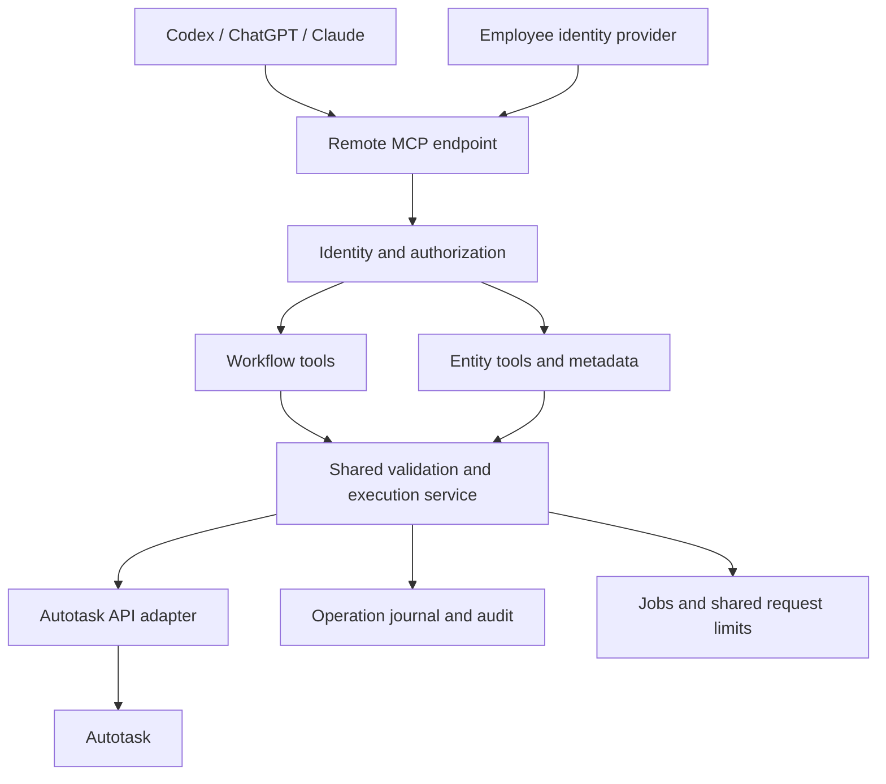

# Rarity Autotask MCP — build specification

> Historical specification: the [current implementation plan](../autotask-mcp-plan/README.md) supersedes this document. Aaron removed the MCP approval layer; authorized actions execute directly and unauthorized actions are denied. Earlier approval proposals below are historical research only.

September 10, 2026. Status: design baseline; no server implementation or tenant connection yet.

**Product objective:** Build and own a comprehensive Autotask MCP for technicians and administrators using Codex, ChatGPT, Claude, and compatible clients. Use the two open-source projects and Thread as research inputs. Autotask's supported API operations define the coverage target; another product's tool catalog does not.

**Confirmed direction:** Deployment must remain portable. Do not require Azure, AWS, or a particular hosting platform. Microsoft Entra ID is a provisional employee identity provider, not a confirmed deployment dependency. Keep identity configuration separate from business logic.

**Meaning of comprehensive**

Track each documented entity and operation separately: query, get, create, update, delete, child collections, special actions, metadata, UDFs, and attachment operations. An entity is not complete because one search tool exists. A generic HTTP request tool is not evidence of coverage. Distinguish API-supported, tenant-permitted, implemented, tested, and unavailable operations.

The API does not expose every UI function, and permitted operations vary by entity and field. Unsupported functions must be recorded with their limitation and a manual handoff; never invent a write endpoint or imply that an API action replicates all UI behavior. [Official entity reference](https://www.autotask.net/help/developerhelp/Content/APIs/REST/Entities/_EntitiesOverview.htm)

**Coverage domains**

| Domain | Intended workflows, subject to actual API support |
| --- | --- |
| Service desk | Ticket creation and triage; assignment; queues/statuses/categories; issue/sub-issue; notes and full history; checklists; relationships; charges; attachments; change requests |
| Time and expenses | Read/create/update/delete where supported; ticket/task/internal time; roles and work types; billability; timesheets; approval state; expense reports and items |
| CRM | Companies, contacts, locations, teams, notes, to-dos, alerts, UDFs, associations |
| Contracts and billing | Contracts, blocks, recurring services/bundles, quantity adjustments, exclusions, billing rules, approved items, invoice-related data |
| Projects | Projects, phases, tasks, dependencies, assignments, estimates, notes, charges, attachments, and project time |
| Scheduling and resources | Service calls, appointments, assignments, resource lookups, availability-related records, holidays and time off |
| Assets and inventory | Configuration items, categories, relationships, warranties/subscriptions where exposed; inventory, products, locations and transfers |
| Sales and procurement | Opportunities, quotes and quote items, sales orders, purchase orders and associated records |
| Knowledge | Articles, article content, notes, tags, associations, and attachments |
| Administration | Supported metadata, picklists, UDF definitions, categories, webhooks, integration diagnostics, and permission diagnostics |
| Reporting | Complete authorized queries, cross-entity joins, resumable exports, time/contract/service reporting, and explicit freshness/completeness markers |

Financial access is a separate permission set, not an automatic consequence of a technician or application-admin role. Managing this MCP's configuration must not automatically grant access to every business record.

**Ideas to adopt**

| Source | Adopt as a requirement | Avoid or correct |
| --- | --- | --- |
| WYRE-AI | Broad entity coverage, metadata discovery, workflow conveniences, configurable impersonation, efficient tool discovery | Previously identified partial PATCH-to-PUT fallback, dropped ticket fields, ignored pagination, invalid contract-service update fields, and internal billing-code selection |
| tphakala | Strong input validation, consistent tool annotations, concurrency/rate/circuit controls, bounded credential-scoped caching | Missing required time-entry fields, restricted ticket creation inputs, and incomplete typed response models |
| Thread | Employee sign-in, member permissions, role-dependent tools, attributed activity, admin switches, workflow-oriented naming | Time/internal-note read gaps, product-plan dependencies, incomplete sync views, and assuming an in-product confirmation UI governs external clients |
| Official Autotask docs | Entity/field capabilities, tenant metadata, child routes, conditional business rules, pagination, identity and request limits | Treating any third-party wrapper as the authoritative API contract |

The existing research files preserve the source evidence. These are design requirements rather than a claim that any source implements every item correctly. If code is reused later, review its license and preserve required notices. New implementations can borrow architectural ideas without copying vendor documentation or prompts into product code.

**Architecture**

Provide one remote MCP service using Streamable HTTP. The shared endpoint must be reachable from the intended clients through the chosen deployment's authenticated network path. Keep the business layer independent of MCP transport, OAuth provider, storage backend, and hosting platform. A container distribution is the proposed portable packaging. A local test harness may call the same business layer, but it must not introduce a production authorization bypass.

Use standard database and queue interfaces. Multiple service replicas must share rate-limit accounting, jobs, and operation state; an in-memory counter cannot be the production cross-instance limit. Cloud secret stores can be optional adapters. No cloud-specific resource identifiers belong in tool schemas or Autotask business rules.

**Two tool layers, one enforcement path**

1. Workflow tools: convenient operations such as ticket triage, complete ticket context, log time, service-call scheduling, contract usage review, project health, and controlled bulk changes. These resolve related records and apply entity-specific rules.
2. Entity tools: discover entities, inspect fields and permissions, query/get, and perform supported mutations through a reviewed capability registry. These provide breadth without hundreds of permanently advertised tools.

Both layers must call the same validation, authorization, execution, and audit services. A discovery tool or generic execution wrapper must never bypass the checks applied to a named tool. Server-side authorization applies to every invocation even if the tool is hidden from that caller's tools/list response. MCP annotations describe intent; they do not grant permission.

Do not expose arbitrary destinations, arbitrary headers, caller-supplied impersonation IDs, or unrestricted raw HTTP. Build routes from a reviewed entity registry and validated parent identifiers. Destination zone discovery and allowed Autotask origins belong to server configuration. Validate pagination URLs and redirects before forwarding credentials.

**Identity and permissions**

- Authenticate the employee independently of Autotask's integration credentials. Validate token issuer, audience, expiry, and tenant binding. Define a stable server-side mapping from the employee identity to an Autotask resource.
- Keep API credentials in server-side secret storage, isolated by Autotask tenant. Never accept a model-supplied username, secret, target tenant, or identity header as an override.
- Define permissions by action and record scope: entity, operation, company, queue/project where applicable, field sensitivity, and workflow state. Use role templates for technicians and admins with explicit additions for finance, billing, integrations, and bulk administration.
- Apply Autotask resource impersonation only where supported and configured. Its scope and creator attribution vary by endpoint. Do not promise universal native permission parity. [Autotask authentication](https://www.autotask.net/help/developerhelp/Content/APIs/REST/General_Topics/REST_Security_Auth.htm), [Impersonation details](https://www.autotask.net/help/developerhelp/Content/APIs/REST/Entities/_EntitiesOverview.htm)
- For unsupported impersonation paths, require an explicitly authorized service-account capability and enforce our own policy. Otherwise reject the operation with an actionable explanation. Never silently retry using broader credentials.
- Apply record scope to direct-ID requests, child records, search counts, caches, exports, jobs, and error output. A company filter visible in a search form alone is insufficient.
- Recheck current access when a write commits or a queued job executes. Membership removal, changed scopes, and revoked sessions must have defined propagation behavior.

**Metadata and API correctness**

Maintain a reviewed registry of methods and root/child routes. Supplement it with tenant entityInformation, fields, picklists, and UDF definitions. Preserve operation distinctions: a field can be required on creation but read-only afterward. Conditional requirements still need entity-specific logic; metadata alone does not encode every business rule. Newly discovered fields and entities should be reported as drift, not automatically enabled for privileged writes. [Metadata API](https://www.autotask.net/help/developerhelp/Content/APIs/REST/API_Calls/REST_EntityInformationCall.htm)

Validate full input schemas, picklist dependencies, resource/role relationships, parent-company associations, date/time conventions, clear-versus-omit semantics, and UDF update behavior. Reject unsupported fields rather than silently dropping a value the user requested. Preserve unknown authorized response fields in a structured detail representation so typed convenience views do not discard data.

Use PATCH for partial updates where supported. Never switch a failed partial update to PUT automatically: omitted PUT properties can be cleared. A necessary PUT implementation requires a separately reviewed entity contract and explicit full-replacement handling. [PUT semantics](https://www.autotask.net/help/developerhelp/Content/APIs/REST/API_Calls/REST_Updating_Data_PUT.htm)

**Write execution and verification**

Resolve identities and related records before constructing the mutation. Produce an exact proposed change where policy requires approval. Ordinary authorized technician updates should remain efficient; deletion, broad bulk changes, billing-sensitive changes, and access changes can require stronger approval according to workspace policy.

For approval-required operations, the server needs a trusted authenticated approval event bound to the actor, tenant, exact payload, and expiry. A model-supplied `approved: true` or an approval token minted by an unrestricted tool is not evidence of human approval. Select the approval mechanism during implementation and verify it with each target client.

Journal the intended operation and any idempotency key before dispatch. Treat a timeout after sending a mutation as an uncertain outcome. Reconcile with Autotask where possible before retrying; do not promise exactly-once execution where the upstream API cannot guarantee it. Suppress duplicate submissions when the journal has a known result. Concurrent-edit detection is best effort unless the endpoint offers an atomic conditional write; a pre-read alone cannot eliminate races.

Read back requested changes after success when the entity supports retrieval. Compare requested and persisted values, including derived fields and attribution. Where readback is unavailable, report upstream acceptance with that limitation. Return explicit states: rejected, awaiting approval, succeeded and verified, accepted but unverified, partially completed, failed, or outcome unknown.

Customer-visible notes must clearly identify their audience. Treat existing ticket text, attachments, and knowledge content as untrusted data, never as authority to grant access or execute another action. Avoid automatic rich-text round trips that can lose formatting or images. For multi-step workflows, retain per-step outcomes and resume points; Autotask operations are not one transaction and rollback may be unavailable.

**Complete reads and operational reliability**

Support both concise responses and full authorized detail. Read internal and external notes, existing time entries, task time, and record relationships through their actual APIs. Pagination applies to child collections as well as root entities. Preserve continuation semantics and return result count, truncation, next cursor, requested scope, and completeness. Distinguish no records from permission-denied, unavailable, and partial results.

Use direct Autotask reads as the default source of truth. Cache metadata and suitable reference data with freshness timestamps and identity/scope-aware keys. An optional webhook index may accelerate discovery, but it needs lag indicators, reconciliation, and explicit completeness limits. Never use a partial indexed count as a complete financial or time total.

Coordinate a configurable request budget across replicas and reserve capacity for interactive requests. Autotask documents a rolling database-wide threshold counting all integrations; monitor ThresholdInformation and adapt to other applications' consumption. Honor Retry-After, use bounded jittered backoff for safe reads, and manage concurrency separately from the hourly budget. Attachments have their own limits. [Autotask limits](https://www.autotask.net/help/developerhelp/Content/APIs/REST/General_Topics/REST_Thresholds_Limits.htm)

Long exports and bulk operations need bounded jobs, checkpoints, cancellation, and per-record progress. Support graceful shutdown and restart recovery. Redact credentials and sensitive fields from operational logs. Audit records should identify actor, tenant, capability, target, sanitized change, approval evidence if required, upstream result, verification outcome, and correlation ID. Define retention and access controls for the audit store rather than logging every full tool argument by default.

**Implementation sequence**

| Milestone | Concrete exit condition |
| --- | --- |
| Coverage inventory | Each entity has documented routes, operation support, rule exceptions, and a tenant-validation status; gaps are explicit |
| Shared foundation | Portable service, employee auth, tenant mapping, capability registry, policy checks, API adapter, pagination, operation journal, audit, and shared request controls |
| Technician workflows | Complete ticket context; notes; ticket/task/internal time; ticket changes; assignments; scheduling; attachments; meaningful tenant readback checks |
| Admin workflows | CRM, projects, contracts, recurring quantities, billing-related data, assets, inventory, sales/procurement, knowledge, and supported configuration operations |
| Production qualification | Client interoperability, permission boundaries, fault recovery, data integrity, load behavior, operating documentation, and supported upgrade/rollback process |

Build the foundation against representative tricky paths early: ticket notes as children, time entries at their root route, and contract-service quantity adjustments as a distinct business operation. Do not defer cross-cutting authorization until after expanding entity coverage.

**Acceptance criteria**

- A technician cannot access or mutate a prohibited record through search, direct ID, a child route, a generic wrapper, a cache, or an export.
- Two users retain distinct permissions and attribution; a revoked user's queued work cannot continue under stale authorization.
- Required fields, explicit clearing, UDFs, picklists, work roles, billability, and conditional contract rules produce correct persisted results.
- Partial updates preserve unrelated fields. No partial payload is sent via an automatic PUT fallback.
- Root and child queries report completeness correctly, including datasets exceeding one API page.
- An uncertain write is not blindly repeated. Multi-step failures report exactly what did and did not complete.
- Internal notes and existing time entries are available to authorized users; reporting does not silently infer them from public ticket messages.
- Every supported operation has a recorded evidence status. Passing mock tests does not count as tenant validation.
- Codex, ChatGPT, and Claude pass real connection, permission, read, write, approval-policy, reconnection, and revocation checks before general release.

**Current deliverables and open decisions**

`entity-coverage.json` preserves 232 rows from the official index, with 231 distinct labels. The index repeats ResourceTimeOffAdditional and contains an unlinked ConfigurationItemExts row. These are inventory discrepancies to resolve, not additional implemented capabilities. All operation support remains marked unverified until individual entity references are reviewed. The source index HTML is retained for traceability.

Hosting remains undecided by choice. Before implementation locks these contracts down, select the employee identity integration, runtime and stable MCP SDK, persistent store, secret provider, approval mechanism, and test-tenant strategy. Infrastructure-specific choices must not change the public tool behavior or Autotask business rules.
