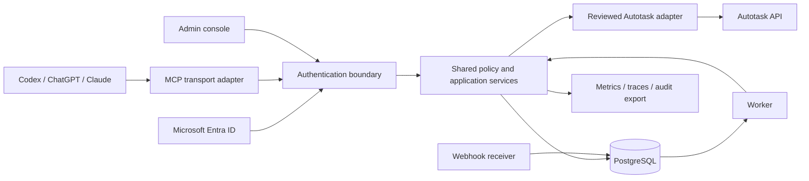

# Architecture, protocol and client connections

**Component boundary**

Keep the transport stateless where its negotiated revision permits. Identity sessions, journaled operations and durable jobs are application records, independent of MCP protocol sessions. An MCP connection ID never grants permission. Portal and worker paths call the same policy/execution service as tools.

Build this architecture incrementally. The first technician release includes mandatory named workflows, a focused admin console, durable journal/jobs and essential audit/recovery. Detailed entity browsing, advanced reporting and extensive sync interfaces are later surfaces; the component diagram does not make them first-release prerequisites. Direct reads are the initial data path. Registry and permission enforcement remain required even without a detailed browser.

**Proposed repository layout**

| Package/application | Responsibility |
| --- | --- |
| apps/server | HTTP routing, MCP adapters, auth discovery and protected-resource metadata |
| apps/console | Entra-authenticated setup, coverage, jobs, audit and operations |
| apps/worker | Durable job execution, reconciliation, retention, scheduled health checks |
| packages/contracts | JSON schemas, operation/result types, error taxonomy and versioning |
| packages/identity | Identity verification, resource mapping, session revocation and role resolution |
| packages/policy | Capability, record, field, workflow-state decisions |
| packages/autotask | Zone discovery, HTTP client, pagination, metadata, routes, entity rules |
| packages/workflows | Ticket/time/scheduling/CRM/finance/project workflows |
| packages/storage | PostgreSQL repositories, migrations, encrypted payloads, jobs and journals |
| packages/telemetry | Redaction, metrics, traces, audit event serialization |
| tests/fixtures, contract, integration, e2e | Sanitized evidence and acceptance suites |
| deploy, docs, registry | Container profiles, runbooks, capability registry and tool documentation |

Use database transactions for our own journal/job invariants. No database transaction can roll back an already committed Autotask API call. Keep this boundary explicit in code and recovery procedures.

**Network surfaces**

| Surface | Audience | Requirement |
| --- | --- | --- |
| /mcp | Authorized AI clients | Authenticated Streamable HTTP; version handling; bounded body and execution limits |
| Protected-resource metadata | MCP clients | Public metadata only; correct canonical resource and authorization-server discovery |
| /admin | Rarity employees | Entra sign-in, CSRF protection, policy checks, no mutation on GET |
| /api/admin/* | Console backend | Same business authorization; explicit admin capabilities |
| /webhooks/autotask/* | Autotask delivery | Verify supported origin/authentication mechanism; bounded ingestion and deduplication |
| /health/live | Infrastructure | Minimal process health, no secrets or tenant details |
| /health/ready | Infrastructure | Readiness for required dependencies; sensitive detail restricted |
| /metrics | Operators | Private/authorized scrape; no customer identifiers as labels |

Routes are proposed application contracts, not deployed endpoints. An optional authorization broker may have separate discovery, authorization, token and client-registration routes. Prefer a maintained identity product/library over hand-built token issuance.

**Entra interoperability decision**

First test direct Entra authorization with preregistered client applications, exact audiences/scopes and approved callbacks for each target client. Entra does not expose an RFC 7591 DCR endpoint; do not advertise one on its behalf. [Microsoft DCR guidance](https://learn.microsoft.com/en-us/microsoft-365/copilot/extensibility/plugin-authentication-dynamic-client-registration)

If client differences prevent a usable direct setup, use a portable MCP-compatible authorization broker federated to Rarity's Entra tenant. Employees still sign in through Entra. The broker issues MCP-audience tokens and supports the client-registration method needed by our supported clients. The broker is a conditional architecture branch, not a hidden prerequisite. Its selection gate compares callback support, PKCE, resource indicators, revocation, maintenance and hosting portability.

**Protocol compatibility**

The current 2026-07-28 specification changes Streamable HTTP: it removes the GET stream endpoint and protocol-level sessions. It also deprecates DCR, sampling, roots and protocol logging. Existing clients may still use earlier revisions. Do not combine legacy initialization/session assumptions with the new transport in one unversioned handler. [Transport](https://modelcontextprotocol.io/specification/2026-07-28/basic/transports/streamable-http), [Deprecated features](https://modelcontextprotocol.io/specification/2026-07-28/deprecated)

At the SDK gate, record supported revisions and test both the actual client negotiation and server routing. Keep legacy compatibility only where target clients require it. The server must reject unsupported versions clearly, not downgrade silently. Support standard tool listing/calls and structured results first. Optional resources, prompts, progress, cancellation and elicitation require negotiated support and a tool-based fallback. Core behavior cannot depend on an optional MCP task/elicitation feature.

**Client qualification matrix**

| Client | Planned connection | Specific validation |
| --- | --- | --- |
| Codex desktop/CLI | Remote HTTP, employee OAuth | Preregistered ID or supported CIMD; callback; scopes; reconnect; tool catalog refresh; client-side approval settings |
| ChatGPT | Workspace-approved custom remote MCP | Workspace entitlement/settings, OAuth registration, full read/write tool behavior, discovery refresh and external network reachability |
| Claude web/Desktop | Custom remote connector | Per-user OAuth, hosted-cloud reachability, canonical resource URI, callback, refresh/revocation |
| Claude Code | Remote HTTP configuration | Native loopback callback, preregistered or discovered client identity, tool output limits, reconnect |

Codex documents preregistered OAuth IDs, CIMD and DCR. ChatGPT supports OAuth and configurable tool availability. These features do not establish Rarity's workspace entitlement or compatibility with our server before testing. [Codex MCP](https://learn.chatgpt.com/docs/extend/mcp), [ChatGPT developer mode](https://developers.openai.com/api/docs/guides/developer-mode)

Claude's hosted connectors originate from Anthropic infrastructure; a server reachable only from a technician's laptop is insufficient. Claude Code has a separate native-client flow. Current Claude documentation supports CIMD and DCR and describes preregistered credentials. Use the official callbacks and egress guidance when configuring the chosen environment; do not hardcode a stale copied IP list. [Hosted connectors](https://support.claude.com/en/articles/11175166-get-started-with-custom-connectors-using-remote-mcp), [Claude authentication](https://claude.com/docs/connectors/building/authentication), [Claude Code](https://code.claude.com/docs/en/mcp)

**Portable deployment profiles**

Start with a single Linux container host: reverse proxy/TLS, application, worker and PostgreSQL. PostgreSQL may be an external managed instance. Permit the same images on a VM, managed container platform or existing infrastructure. Object storage is an interchangeable file-export adapter, with a local persistent volume option for a small deployment. Database backups and secrets must live outside ephemeral containers. Kubernetes and a separate Redis layer are not required for v1.

The admin UI and MCP share a canonical hostname or explicitly configured origins. Validate Origin when present, allow only intended browser origins, and do not require browser-only headers from native/cloud clients. Reject arbitrary forwarding headers unless set by a trusted proxy. Configure public URLs explicitly; never construct OAuth redirects from untrusted Host headers.

**Shared technician services**

Add packages/resolution for scoped business references, eligibility and versioned default selection, plus packages/workflows for fixed workflow definitions, context recipes, step journals and receipts. These call the existing policy/adapter services; no separate model service or arbitrary chain execution API is introduced. Versioned playbooks distribute through MCP resources/prompts where supported and ordinary list/get tools otherwise. See [17](17-TECHNICIAN-WORKFLOW-CONTRACT.md).
