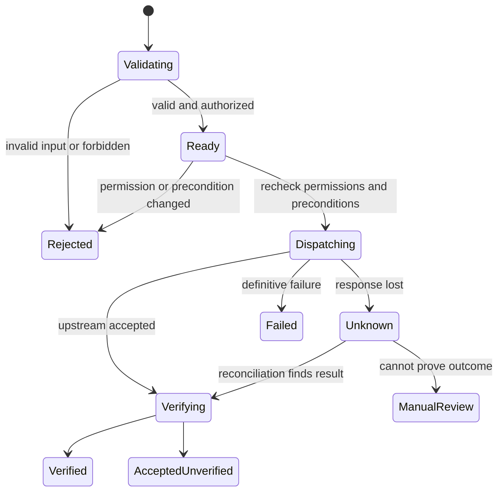

# Data, background jobs, synchronization and files

**Persistence model**

PostgreSQL is the proposed durable store. Keep customer content out of it unless needed for an authorized operation, short-lived export, job recovery or explicitly enabled index. Store Autotask IDs as correctly ranged numeric/string identifiers according to schema; monetary values use decimal-safe representations, never binary float arithmetic for totals.

Stage persistence with the shipped capabilities: initial connection configuration, identity/mapping, permissions, operation journal, jobs and activity/recovery evidence support the focused technician release. Webhook/index records, advanced reporting and their extensive interfaces arrive with the corresponding later features. Durable storage remains justified by shared administration and recovery even though there are no approval records or portal.

| Record group | Minimum fields and invariants |
| --- | --- |
| instance_config | Internal tenant key, Autotask zone, credential references, deployment URLs, enabled domains; one production instance initially |
| principals/resource_mappings | Entra tid+oid, active state, Autotask resource ID, mapping provenance/version, last resource verification time, timestamps; unique validated mapping |
| role_bindings/policy_versions | Capability sets, company/project/team scope, field restrictions, effective dates, immutable published policy version |
| auth_sessions/revocations | Hashed session/token identifiers as applicable, expiry, principal, client registration, revocation reason |
| metadata_snapshots | Entity/field/picklist/UDF data, hashes, source time, credential profile, validation status |
| operation_journal | Requester, execution identity mode, resource ID and mapping version, exact payload hash, encrypted necessary intent, policy/schema versions, idempotency key, state, upstream IDs, dispatch attempts, uncertainty and verification; unique dedupe key |
| jobs/job_items | Owner, operation kind, scope snapshot, current authorization check, checkpoint, lease, progress and per-item outcomes |
| webhook_subscriptions/events | Owned subscription IDs, secret reference, event/delivery IDs, sequence, receipt time, signature outcome and processing state |
| reconciliation_watermarks | Entity/scope, cursor/window, overlap policy, last success, lag and failure details |
| artifacts | Owner/scope, parent record, storage key, MIME, bytes, checksum, expiry and access log |
| audit_events | Append-only actor/action/target/outcome metadata, redacted diff, policy/operation correlation |

Row-level database controls can add defense in depth, but application authorization remains mandatory. Test and production databases/credentials must be separate even though v1 serves one production tenant. Backups, migration tools and audit exports require their own access controls.

**Operation state machine**

Our journal commit precedes outbound dispatch. A crash after dispatch must not cause a worker to blindly repeat creation. Require idempotency keys for client-initiated mutations and derive stable item keys for authorized batch steps. Key reuse with a different payload is a conflict. Retain the journal long enough to cover realistic client retry windows; exact retention is an operational decision.

Do not promise exactly-once writes across an API without upstream idempotency. The guarantee is that known duplicate requests return the recorded outcome and uncertain outcomes enter reconciliation. A failed audit/journal store blocks new writes; read availability can degrade separately. If persistence fails after Autotask accepts a write, surface the uncertainty and reconcile.

**User-initiated jobs**

All deployments need durable jobs for long exports and authorized bulk operations. Aaron selected interactive use first and deferred unattended recurring automations. User-started jobs return immediately with an ID, estimate and status route; they do not rely on a client's chat staying open. The requester can inspect progress and cancel remaining work through MCP or the portal. This background completion is distinct from autonomous scheduled work.

Workers use leases with fencing/version checks, heartbeats, bounded retries and recoverable checkpoints. Re-authorize at execution and before each item. Never substitute changed payloads under existing item request keys. Preserve completed items on partial failure and produce an explicit remainder plan. Cancel marks undispatched items cancelled; an in-flight API call may still complete and must be reconciled.

Prioritize interactive requests ahead of exports and bulk work. Impose per-principal and instance quotas, maximum report scope and storage budgets. Show why a job is waiting: rate limit, lock, upstream outage, resource scope or capacity. Concurrent jobs must not consume the entire shared Autotask budget.

**Reporting and complete reads**

Define reports as reviewed joins over specific entities and fields. Record the query window, timezone, currency, included/excluded states, source timestamps, rows visited and capped/failed collections. Preserve decimal values and currency rather than summing mixed currencies silently. A report over a changing dataset is not an atomic database snapshot; explain and bound its consistency.

Use streaming or chunked output for large results; return a preview plus a protected export artifact. CSV must neutralize formula injection; spreadsheets/files may contain sensitive financial or personal data. Exports retain principal/record scope and require fresh authorization at download, including after a user's access changes. Do not treat an unguessable artifact URL as sufficient authorization.

**Webhook pipeline**

1. Create/manage only subscriptions owned by this MCP, under authorized configuration.
2. Verify Autotask's documented X-Hook-Signature (`sha1=` with Base64 HMAC-SHA1) over the raw request body using the configured secret, with constant-time comparison and proper malformed-header rejection. Preserve the raw bytes before parsing. Do not substitute a different algorithm or IP allowlisting for the upstream signature contract. [Signature reference](https://www.autotask.net/help/developerhelp/Content/APIs/Webhooks/SecretKeyPayloadVerification.htm)
3. Persist a bounded receipt and dedupe key, then acknowledge according to the documented delivery contract.
4. Process asynchronously; handle duplicates, sequence gaps and out-of-order events. Fetch the current authorized record when event content is insufficient or stale.
5. Maintain per-entity/scope freshness watermarks. Reconcile periodically using overlapping change windows, supported activity/deletion logs and bounded full checks when necessary.
6. Excluded scopes and subscription downtime create explicit gaps. Re-enabling does not imply missed events were replayed.

Webhook error logs may contain full customer payloads. Restrict them as sensitive data and redact operator summaries. One webhook sequence cannot be assumed to cover all entities or credentials. Source: [Webhook reference](https://www.autotask.net/help/developerhelp/Content/APIs/Webhooks/REST_WebhooksEntity.htm), [Webhook errors](https://www.autotask.net/help/developerhelp/Content/APIs/Webhooks/WebhookEventErrorLogEntity.htm).

An index is optional. Direct Autotask reads remain available without it. If an indexed query is incomplete or stale, disclose that and offer a direct complete job; never silently switch a financial report to partial indexed data.

**Attachment and artifact service**

Support list/get/upload and supported deletion through each parent's real endpoint. Authorize the parent and associated content classification first. Validate MIME, extension, decoded size, checksum and upload ownership. Reject file URLs that direct the server to private/metadata endpoints or arbitrary third-party hosts. Prefer a portal upload or a negotiated client-supported file channel; do not assume every MCP client can upload local paths.

Use short-lived upload intents tied to the principal and target record. Scan uploads before publishing to Autotask and remove expired staged files. Downloads use an authenticated portal or capability-checked fetch tool with bounded chunks. Sanitize filenames and content-disposition; never serve active HTML as trusted application content. Keep invoice HTML/XML isolated or downloaded as files.

Autotask documents an individual API attachment limit of approximately 6–7 MB and a 10,000,000-byte creation budget over five minutes. Validate actual route limits during qualification and keep limits configurable within upstream allowances; no inherited arbitrary 3 MB ceiling. [API limits](https://www.autotask.net/help/developerhelp/Content/APIs/REST/General_Topics/REST_Thresholds_Limits.htm)

**Proposed retention defaults to review**

Operational logs: 30 days; security/audit metadata: 365 days; completed job payloads: 7 days; exported files and staged uploads: 24 hours; metadata snapshots: latest plus 30 days of drift history. These are proposed defaults, not regulatory or contractual requirements. Allow shorter content retention than audit metadata. Legal holds, backups and deletion propagation need an explicit policy before production.

**Workflow step persistence**

Use the existing operation journal/job store for root workflow IDs, definition/version, immutable resolved inputs/default provenance, actor/mapping version and per-step prerequisites, dedupe keys, native IDs and verification states. Known failed/undispatched steps can resume through at_operation_resume with fresh authorization and the original payload. Unknown effects require reconciliation; verified steps never repeat. Relative dates freeze at original resolution. Do not add a parallel approval or arbitrary-chain store. [Workflow contract](17-TECHNICIAN-WORKFLOW-CONTRACT.md).
