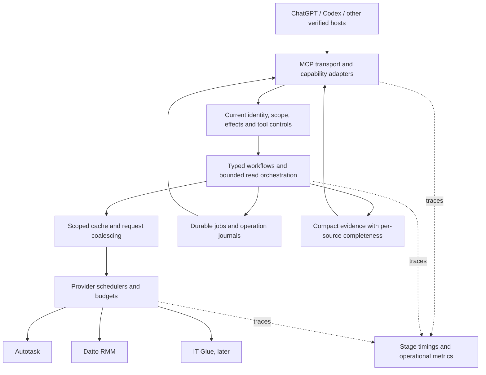

# Autotask MCP Project 2.0 — research and implementation plan

Publication note: this historical assessment names revisions, file line numbers,
and CI records from the original private development repository. The public
source snapshot starts with fresh history; those records are retained as
provenance and are not publicly accessible validation links.

Implementation follow-up: [September 20 progress and remaining acceptance gates](../IMPLEMENTATION-PROGRESS-2026-09-20.md). Original plan retained below.

**Status: implementation complete for the reviewed candidate scope, September 20, 2026.** Deployment is deferred at the user’s request. Research date: September 17, 2026; the assessment below preserves that historical baseline.

- [x] W01–W09: implementation and local protocol, execution, discovery, cache, investigation and durable-report tests.
- [x] W10: isolated Tasks adapter and ordinary report fallback; native Tasks routing remains disabled pending SDK/host qualification.
- [x] W11: read-selection MRTR and fallback, replay/expiry checks, actual SDK round-trip.
- [x] W12: IT Glue integration and scoped correlation code.
- [x] W14: versioned local package/image, migrations and regression/build evidence.
- [ ] W10–W11: native Tasks and actual-client/confirmation pilots — deferred.
- [ ] W12: real IT Glue account qualification.
- [ ] W13: optional resources/prompts/subscriptions — explicitly deferred without a qualified host use case.
- [ ] W14: deployment identity and fresh ChatGPT/Codex acceptance — deferred.

See the linked implementation ledger for evidence and limits; unchecked optional/external gates are not represented as shipped.

Repository baseline: `AaronCampbellit/Autotask_MCP@c9175fac35e9e0ce0130f3f33a192618848df261` (private development commit). Application release: `0.1.0-mcp-expanded.20260917.3`. SDK server/core: `2.0.0`.

## 1. Assessment and evidence boundary

The project already uses the v2 SDK correctly for its basic serving model. It supports the modern protocol as well as older clients, publishes validated structured output, and has substantial authorization, journal, and workflow infrastructure. The opportunity is application-level adoption of useful v2 capabilities and better execution efficiency.

This assessment combines repository-wide symbol searches, detailed reads of the transport/runtime/provider/workflow/job/cache paths, the existing tests, GitHub CI logs, and official specifications. The exact server/core npm archives were downloaded for source inspection and their SHA-512 integrity verified against the project lockfile. No dependencies were installed or package code executed during that inspection.

The reviewed commit’s GitHub Actions run `35271662839` (private development history) passed 782 tests. It measured full discovery at 1,739,552 bytes for legacy and 1,739,729 bytes for modern. Static catalog inspection found 281 operations, including 55 RMM operations, and 191 distinct output contracts. The repository contains 67 test files and 120 TypeScript files under the server/packages paths; these are inventory counts, not a claim that every line was manually audited.

After the initial review, the user authorized dependency installation. The baseline passed a fresh local run of all 782 tests, typechecking, compilation, Compose validation, and the container build; see [local validation](VALIDATION.md). I did not probe production, measure current host capabilities, perform a security audit, or validate live provider writes. Existing deployment records are recorded evidence, not new runtime verification. Proposed performance numbers below are acceptance targets.

### Three distinctions that guide the plan

- **SDK 2.0, MCP 2026-07-28, and Project 2.0 are separate versions.** A product milestone does not change the wire protocol automatically.
- **Optional features are not compliance defects.** No Tasks, prompts, or resources does not make this an old SDK server. Disabled change notifications are currently advertised honestly.
- **Stateless transport does not mean stateless business operations.** Durable operation IDs, approval handles, jobs, and encrypted receipts remain necessary. See the [base protocol](https://modelcontextprotocol.io/specification/2026-07-28/basic).

## 2. SDK and architecture gap assessment

Priorities: P0 establishes evidence; P1 improves core execution; P2 adds capabilities; P3 is conditional. Finding IDs map to the [evidence register](EVIDENCE.md).

| Capability | Current status | Interpretation |
| --- | --- | --- |
| Modern stateless requests and discovery | Implemented through SDK; representative tests pass | Expand conformance evidence, retain legacy support |
| Header and wire-field handling | Delegated to the locked SDK | Test integration; do not duplicate the SDK |
| Structured outputs and local schema references | Implemented and validated | Preserve; optimize payloads without losing evidence |
| Protocol cache hints | SDK defaults to private, zero TTL | Conformant, but unused optimization |
| Progress and cancellation | Ingress/local timeouts exist; application context and streaming incomplete | Lifecycle improvement needed |
| MRTR clarification | Not used by application | Optional capability with a clear selection use case |
| Official Tasks extension | Not registered; custom durable jobs exist | Optional adapter plus substantial job-model work |
| List-change subscriptions | Explicitly disabled | Honest capability choice; enable only with lifecycle/client evidence |
| Resources/prompts | No runtime registrations found | Optional; adopt only for demonstrated host workflows |
| Tracing and efficient orchestration | Partial operational diagnostics and existing composites | Major application-level opportunity |

### F01 — Basic modern protocol support is present; integration coverage can be stronger [P0]

`app.ts` uses `createMcpHandler`, passes the original request headers and parsed body, and retains legacy stateless compatibility. Tests exercise modern envelopes, discovery, output schemas, and unsupported versions. The pinned SDK contains standard-header validation; absence of handwritten `Mcp-Method` logic is not a missing implementation.

The gap is proof at the application boundary: add explicit cases for missing/mismatched method/name/version headers, required metadata, notification response semantics, unknown methods, schema dialect/reference behavior, and the real Node ingress. Test errors that the application creates before the SDK separately from SDK JSON-RPC errors. Do not rewrite SDK negotiation or inject `resultType` into domain responses. [HTTP specification](https://modelcontextprotocol.io/specification/2026-07-28/basic/transports/streamable-http), [SDK migration guide](https://ts.sdk.modelcontextprotocol.io/v2/migration/support-2026-07-28).

### F02 — MCP caching is conformant but effectively disabled [P1]

The server supplies no `cacheHints`. Inspection of the locked SDK confirms defaults of `ttlMs: 0` and `cacheScope: private`; the missing application fields are not malformed wire output. The HTTP wrapper separately sets `Cache-Control: no-store`.

Add a short private TTL to tool metadata only after testing host behavior and authorization changes. Initially propose 30–60 seconds, configurable and independently disableable. Keep every execution authorized against current policy regardless of cached discovery. Metadata caching and provider-data caching require separate designs; MCP hints do not cache `tools/call` business results. A cached tool list must never become an execution grant. [SDK cache behavior](https://ts.sdk.modelcontextprotocol.io/v2/clients/caching.html).

### F03 — Discovery size and registration work need a deliberate budget [P1]

Every request calculates available tools and registers the full authorized list. CI’s modern full-catalog response is about 1.74 MB, against the test’s 1.8 MB ceiling and its reported 2 MB connector limit. That limit is a project compatibility assumption, not a universal MCP limit.

The repository already compacts repeated output-schema fragments. Retain it. Introduce immutable precomputed schema representations, benchmark registration cost, and pilot a stable technician profile. Keep common, accurately annotated write tools directly exposed. Evaluate pagination for transport size, but do not assume it reduces model context: a host can aggregate every page. See [tool listing rules](https://modelcontextprotocol.io/specification/2026-07-28/server/tools).

### F04 — Existing discovery helpers need better progressive use [P1]

`at_discover`, `at_describe`, and `at_invoke` already exist. However, `at_discover` can return all matching descriptions without a result limit, and direct SDK discovery still publishes the entire set. `at_invoke` has mixed/destructive annotations because it can write; routing ordinary reads through it can make host approval behavior less precise.

Add bounded operation search with categories and stable cursors. Prototype a strictly read-only dispatcher for infrequent reads, using actual execution policy rather than the generated catalog’s simple read/write field. Keep mutations typed and separately visible. Availability must depend on explicit server configuration and request authorization, not on previous discovery calls or a connection’s browsing history.

### F05 — Responses are buffered, preventing useful incremental progress [P1]

`completeResponse` consumes the entire SDK body before returning it, including SSE, and caps total bytes at 4 MiB. The Node adapter itself can stream; the application wrapper is the limiting layer. Simply adding progress notifications would leave them buffered until completion.

Introduce bounded streaming with backpressure, disconnect cleanup, and admission held until the stream completes or is cancelled. Preserve a byte limit for finite JSON responses; define separate event/queue/lifetime limits for streaming responses. Once headers are sent, failures cannot be replaced with an ordinary HTTP JSON error. Design and test that lifecycle explicitly before subscriptions or progress are enabled. [SDK HTTP serving](https://ts.sdk.modelcontextprotocol.io/v2/serving/http.html).

### F06 — Cancellation and request deadlines stop short of domain execution [P1]

Tool callbacks accept arguments but discard the SDK context. `ToolSpec.run` receives only principal and input. Ingress has an abort signal, and some providers have local timeouts, but there is no common end-to-end deadline or cancellation context. The Autotask budget supports a signal, while many callers supply only tenant/actor. Execution controls explicitly track work that outlives a disconnected client.

Introduce an execution context with signal, deadline, trace context, progress capability, and request identity. Propagate it through read queues, adapters, pagination, and orchestration. Cancel queued/read work promptly. After a mutation may have been dispatched, preserve or reconcile its durable outcome; a disconnected client is not proof of cancellation or a reason to replay the write. [SDK progress and cancellation](https://ts.sdk.modelcontextprotocol.io/v2/servers/logging-progress-cancellation.html).

### F07 — No continuous end-to-end observability [P0]

There are audit records, budget counters, release diagnostics, and historical latency investigations. Repository searches found no OpenTelemetry setup or trace-context propagation, and the tool wrapper does not capture stage timings. Current diagnostics cannot separate provider latency from local computation or model/client overhead.

Instrument one request across ingress, identity, tool availability, schema registration, domain execution, budget wait, provider attempts, output validation, and serialization. Link request, job, and operation IDs internally. Record p50/p95/p99, attempts, cache hits, bytes, throttling, and outcome class. Use low-cardinality labels; exclude tokens, record text, file data, and unrestricted baggage. Record DNS/connect timing only if transport instrumentation actually supplies it. [MCP trace conventions](https://modelcontextprotocol.io/specification/2026-07-28/basic).

### F08 — Composite retrieval is real, but still repeats and serializes work [P1]

`ticketContext` awaits collections in a loop. `rmm_ticket_context` retrieves device then alerts; link resolution and final recheck also retrieve device/site evidence. Snapshot creation awaits summary, audit, and software retrieval. Some repeat reads are authorization or drift safeguards and must remain.

Build a bounded dependency graph after identity resolution. Reuse equivalent read evidence within the same validation stage and run independent branches concurrently. Revalidate sensitive associations at defined boundaries. Do not parallelize dependent cursor pages or ordered writes. The Autotask scheduler explicitly rejects parallel nested preflight lease borrowing; preserve that invariant or redesign it with dedicated tests before changing that path.

### F09 — Data caches exist, but coverage and lifecycle are inconsistent [P1]

There is already a scoped 60-second operational metadata cache, a work-management field cache, a ticket-status metadata cache, a refreshing metadata provider, and RMM token reuse. “Add caching” from scratch would duplicate existing mechanisms.

Create a common bounded cache contract with scope/version-aware keys, memory limits, expiry cleanup, in-flight request coalescing, explicit refresh, and metrics. The operational metadata map has TTL checks but no visible eviction bound in that class. Start with dictionaries and projections, then use short-lived device/alert caches only where freshness is explicit. Never reuse an old cached authorization decision or substitute cached mutable state for required pre-dispatch checks.

### F10 — Durable jobs are not the official Tasks extension [P2]

The existing job API accepts seven write workflow kinds and the worker associates jobs with operation-journal results. It does not yet provide general read/report jobs, protocol `tasks/get/update/cancel`, or task capability negotiation. The extension requires client capability advertisement and durable creation before a handle is returned. Crucially, protocol `completed` can contain a tool error; protocol `failed` is reserved for JSON-RPC failure. [Released Tasks specification](https://tasks.extensions.modelcontextprotocol.io/specification/2026-07-28/tasks).

First add a versioned durable read/report job model and a protocol-independent job view. Then map it into an extension adapter. Retain existing operation receipts unchanged inside final task results. A lease expiry must not cause uncertain writes to replay. Validate the supported TypeScript extension integration in a spike; do not confuse legacy exported task types with a working modern Tasks runtime.

### F11 — MRTR clarification is unused; custom confirmation already exists [P2]

No application use of `inputRequired`, `inputResponses`, or `requestState` was found. Closed-opportunity note workflows already have custom confirmation tokens and guarded recovery; that is a foundation rather than a reason to rebuild approvals.

Use MRTR first for ambiguous record selection. Add an adapter for an existing confirmation workflow only after host acceptance tests. Bind each continuation to actor, tenant, operation, input fingerprint, expiry, and relevant record version. Use opaque stored handles or authenticated state; signatures alone do not hide sensitive content. Reject changed targets, stale approvals, and replay. Missing client support should yield a bounded candidate/confirmation result through the existing tool flow, not an unusable interaction. [SDK MRTR guide](https://ts.sdk.modelcontextprotocol.io/v2/servers/input-required.html).

### F12 — Notifications are intentionally disabled [P3]

`tools.listChanged: false`, `maxSubscriptions: 0`, per-request handlers, and response buffering are consistent with the current architecture. Do not mark this as a protocol defect or merely flip the capability to true.

If measured client support justifies it, use a long-lived handler/event bus with fresh request-specific server instances, scoped subscription delivery, expiry/revocation handling, and separate capacity limits. Emit catalog-change events without leaking another principal’s tools. Keep manual client refresh as a distinct release step. [SDK notifications](https://ts.sdk.modelcontextprotocol.io/v2/servers/notifications.html).

### F13 — Structured output is strong; result volume can be better controlled [P1/P2]

The application validates outputs and returns the same object as `structuredContent` and JSON text. That is an intentional compatibility pattern; deleting the text copy blindly is not recommended. Reports also return detailed records alongside grouped counts, and large contexts may include more evidence than the user needs.

Add summary/detail modes, explicit collection selection, per-section item/byte limits, and independently resumable sections. Preserve IDs, record URLs, original filters, completeness, and observation timestamps. Offer authenticated artifact/resource references for large report details when hosts can use them; retain ordinary artifact tools otherwise. [SDK resources](https://ts.sdk.modelcontextprotocol.io/v2/servers/resources.html).

### F14 — Effect metadata has more than two meanings [P1]

`operationCatalog` has a boolean write field, while executable `ToolSpec` also carries mixed/local effects and special handling for job cancellation. The generated read/write label therefore does not fully describe side effects. `at_invoke`, artifact creation, staging, snapshots, and job cancellation must not be classified by that boolean alone.

Create one authoritative effect model distinguishing read, local persistence, native mutation, orchestration, and cancellation, with overwrite/destructive and idempotency properties. Generate discovery labels, MCP annotations, documentation, and dispatcher eligibility from it. Verify each annotation against behavior; this improves host tool selection and approval precision without replacing server authorization.

### F15 — IT Glue remains a separate integration project [P2]

The repository contains substantial IT Glue research but no runtime integration. Start with reviewed company-to-organization mappings and read-only configuration/document metadata, then bounded document retrieval. Existing research should be refreshed, not discarded.

Validate the exact API endpoints needed for an example investigation before promising document contents or full-text search. Apply company scope before returning search candidates. Keep password/secret retrieval and document mutation outside the first release. IT Glue publishes a 3,000-request/5-minute throttle; the implementation still needs a conservative shared budget and handling for tenant-specific restrictions. [Official API reference](https://api.itglue.com/developer/).

### F16 — Stateless serving is not yet a multi-replica design [P3]

Autotask/RMM request accounting, concurrency controls, caches, and subscription state are process-local. The supported deployment is one server/collector. PostgreSQL job leases help durability but do not make rate accounting distributed.

Optimize the current topology first. Before adding replicas, coordinate provider budgets, cache invalidation, job ownership, task state, and event delivery. Datto’s published rate limit applies across the account; the current client deliberately uses lower local limits. Increasing process count can multiply those limits. [Datto API guide](https://rmm.datto.com/help/en/Content/2SETUP/APIv2.htm).

### F17 — Release evidence should include actual host behavior [P0/P1]

CI gives strong fixture evidence, including both wire eras. It does not prove a specific ChatGPT/Codex connection uses modern negotiation, honors caches, supports Tasks/MRTR, follows pagination, or refreshes tool metadata. The official pages reviewed did not establish that full capability set for every target host.

Maintain a dated host/version/connection matrix with actual requests and observed behavior. Test a fresh conversation after metadata changes. OpenAI’s current developer-mode procedure requires refreshing the connection and verifying metadata; published plugin review is a separate distribution path. Do not assume an application version bump or notification refreshes every host. [Official OpenAI refresh guidance](https://developers.openai.com/plugins/deploy/connect-chatgpt#refresh-metadata).

## 3. Target architecture

Keep one logical orchestration layer built around the existing services. Do not add another LLM solely to coordinate deterministic API reads. Use typed, reviewed plans and let the calling assistant interpret evidence.

### Execution context

Add a small shared context passed explicitly or through a tightly scoped execution helper: request ID, trace context, deadline, cancellation signal, protocol/client capability facts, optional progress callback, and stage-local evidence cache. The current principal remains an authenticated input, never something accepted from tool arguments. A background job has its own execution lifetime and reauthorizes when it runs.

Reuse immutable schemas and provider connection pools across requests. Continue creating request-specific MCP server instances as the SDK expects. If handler lifetime is extended, never close over a previous caller’s principal. [SDK factory guidance](https://ts.sdk.modelcontextprotocol.io/v2/serving/http.html).

### Evidence and caching contract

Use a shared cache key based on provider connection/account, tenant, authorization/scope fingerprint, mapping/policy version, entity ID, selected fields, query, and relevant schema version. Coalesce only equivalent reads. Return original observation time and cache age; a cache hit must not get a fresh-looking timestamp.

Suggested starting TTLs are experiments: dictionaries 60–300 seconds; device summary 30–60 seconds; alert summaries 10–15 seconds. Keep mutable pre-write state uncached across validation boundaries. Cached metadata cannot establish that a live device is healthy, and an audited inventory timestamp differs from the time the API returned it.

Invalidate relevant observations after a verified write and on mapping/configuration changes. For unknown write outcomes, mark affected observations uncertain or force refresh; do not optimistically assume the mutation occurred. Apply memory/entry bounds and expiry cleanup from the first implementation.

### First investigation tools

| Proposed tool | Inputs and scope | Compact result | Deliberate boundary |
| --- | --- | --- | --- |
| `ticket_investigate` | Native ticket reference; purpose; requested sections; time window | Ticket summary, verified device mapping, alerts, relevant related tickets, source timestamps, gaps, links | No component execution or ticket mutation |
| `client_overview` | Resolved company ID; selected sections; time window | Bounded open-ticket summary, mapped site/device summary, alerts, later document references | Never claims a complete fleet from one page |
| `device_investigate` | Native device UID or a verified asset mapping | Audit facts, alerts, related ticket evidence, observation timeline | Correlation is evidence, not proof of root cause |
| `client_health_report_start` | Company ID; report definition; bounded scope | Durable report/task handle and later a summary plus artifact | Explicit local job/artifact effects; no provider writes |

Resolve fuzzy names once and return native IDs. If ambiguous, return authorized candidates or request clarification. Related-ticket matching must disclose whether it used an exact relationship or a heuristic. One unavailable optional provider should produce an explicit unavailable section, not erase valid evidence from other branches. Authentication/scope failures are not ordinary partial-data successes.

Each section should carry `status`, `source`, `observed_at`, `cache_age_ms`, `items`, `completeness`, and an optional continuation. Add a top-level scope, truncation reasons, bounded references, and gaps. Avoid an arbitrary confidence percentage or unsupported “root cause” label.

## 4. Delivery work packages

Effort labels are relative engineering scope: S is contained, M crosses a few modules, L changes lifecycle/storage or external integrations. They are not calendar estimates. Deliver sequentially through gates; later capabilities can be piloted behind flags.

| ID | Work package | Dependencies | Size | Required acceptance evidence |
| --- | --- | --- | --- | --- |
| W01 | Baseline, capability matrix, protocol regression harness | None | M | Reproducible selected scenarios; cold/warm timings and call counts; both eras through real HTTP; header/metadata/error cases |
| W02 | Shared execution context and tracing | W01 | M | Request spans connect auth → queue → providers → result; no secret/text payload capture; metrics overhead measured |
| W03 | Read cancellation and bounded response streaming | W02 | L | Abort removes queued work; progress reaches socket before completion; slow/disconnected consumers release capacity; ambiguous writes remain recoverable |
| W04 | Immutable schema cache, deterministic discovery, private TTL pilot | W01, W02 | M | Same authorized set has stable ordering/digest; schema conversion cost falls; policy changes still deny execution immediately; cache partition tests |
| W05 | Effect model and stable technician discovery profile | W04 | M | Direct tool annotations and generated catalog agree; profile does not grow per connection; long-tail reads cannot dispatch writes; old profile retained |
| W06 | Stage-local read reuse and bounded fan-out | W02 | M | Measured call-count reduction in RMM/ticket contexts; cross-scope and drift tests; no scheduler lease violations |
| W07 | Shared bounded metadata/data caching | W02, W06 | M | TTL/eviction/coalescing tests; original timestamps preserved; policy/config invalidation; no stale pre-write authorization/state reuse |
| W08 | Ticket/client investigation contracts and tools | W05–W07 | L | Evidence schema, partial-provider behavior, matching provenance, independent continuations; fewer model tool turns on fixture scenarios |
| W09 | Durable read/report job model | W02, W08 | L | Persisted versioned inputs/results; worker restart recovery; leases/fencing; quota/expiry/purge; read-only provider behavior |
| W10 | Tasks extension adapter and host pilot | W01, W09 | L | Released extension shapes and capabilities; durable handle; status/result mapping; cancellation semantics; ordinary tool fallback |
| W11 | MRTR ambiguity and existing-confirmation adapters | W01, W02 | M | Accept/decline/cancel/unsupported-host tests; actor/input binding; expiry/replay checks; fresh reauthorization before effects |
| W12 | Read-only IT Glue integration and correlation | W07, W08 | L | Current route qualification; approved organization mappings; bounded retrieval, rate budget, content redaction, source attribution |
| W13 | Optional resources/prompts and subscriptions | W03, W04, host evidence | M/L | Concrete supported host use case; scoped reads/events; stream limits and revocation; fallback still works |
| W14 | Release packaging and operational acceptance | Each milestone | M | New release/image; migrations and rollback tested; correct running identity; client metadata and fresh-chat workflow verified |

### Milestone A — establish trustworthy measurements

Deliver W01–W02 first. Select six baseline flows: exact-ID ticket context, fuzzy ticket lookup, RMM ticket context, current-user workday, discovery, and report retrieval. Include a fixture-only time/document write to count preflight/readback calls without touching live records. Capture request count, returned bytes, p50/p95 latency, errors, and completeness for each. Separate local server time, provider time, and end-to-end assistant time.

Initial compatibility rows: a pinned reference v2 SDK client, legacy reference client, actual Codex connection, and actual ChatGPT developer-mode/tunnel connection. Record host version/date, protocol, cache behavior, schema refs, progress, cancellation, MRTR, Tasks, subscriptions, and metadata refresh. Unknown stays unknown; generic MCP support is insufficient evidence.

### Milestone B — make common operations faster

Deliver W03–W07 incrementally. First optimize `rmm_ticket_context` and ticket collection reads; these are bounded, existing workflows with clear correctness expectations. Keep dispatch-boundary rechecks. Pilot discovery profiles without removing the current full catalog. Define the default profile from measured technician usage and scenario evaluations, not an arbitrary tool count.

For discovery, target at least 50% fewer serialized bytes for the proposed default profile and retain the existing full-catalog ceiling. For selected composite reads, target at least 30% fewer provider calls and 30% lower p95 elapsed time under comparable conditions. Reject optimizations that increase false completeness, stale authorization, throttling, or uncertain writes.

### Milestone C — answer technician questions with evidence

Deliver W08. Start `ticket_investigate` as a new contract; preserve existing tools. Add `client_overview` after its sections have clear bounds and source timestamps. Build a fixture evaluation set including duplicate hostnames, moved devices, missing native links, partial ticket pages, stale inventory, provider timeout, revoked access, and no relevant findings.

Evaluate both direct tools and discovery-assisted invocation. Count model turns separately from native HTTP requests. A single composite can reduce model turns while increasing upstream cost; both numbers must be visible.

### Milestone D — durable and interactive execution

Deliver W09–W11. Implement the first asynchronous report without native business writes. Persist a handle before returning it. Keep job lifecycle, MCP lifecycle, and business outcome separate. A completed report can be partial; a completed tool task can contain an uncertain write receipt. Cancellation should stop undispatched work and further read branches, but never claim to undo already accepted provider effects.

Before expanding jobs, address the current worker’s fixed five-minute lease/no visible renewal loop. Choose bounded job duration or add renewal and fencing tests. Persist continuation checkpoints for resumable read scans and detect source changes; do not manufacture an atomic snapshot across pages. Retain `at_job_*` or equivalent ordinary status/results access for unsupported clients.

MRTR starts with selection, not destructive execution. Extend existing confirmation mechanisms after validating the exact client flow and keeping approval bound to the reviewed action.

### Milestone E — add knowledge and qualify operations

Deliver W12 and only justified portions of W13. Reuse the existing IT Glue research inventory, but qualify current endpoints, license/access, and actual returned fields. Map companies and organizations explicitly; do not silently join by name. Return a few relevant documents/configurations with provenance and safe retrieval handles. Keep arbitrary credential retrieval and unrestricted documentation indexing out of the first milestone.

After observed demand, consider background read collectors for fleet queries. A collector is a separate feature with freshness, deletion, quota, retention, and reconciliation responsibilities; the current webhook inbox is not a complete replica.

## 5. Acceptance and regression strategy

Use the existing test suite and add tests where lifecycle or contracts change. These are implementation gates for future changes. The existing baseline suite was rerun successfully; the proposed new tests have not been implemented.

| Test family | Essential cases |
| --- | --- |
| Protocol boundary | Modern + legacy; missing/mismatched headers; missing capabilities; unknown methods; malformed/oversized requests; discovery/schema output |
| Streaming/cancellation | Progress before final result; body read cancellation; abort while queued; slow consumer; disconnect after native dispatch; shutdown without leaked admission |
| Cache/isolation | Two employees, changed scope, mapping/config version changes, exact field/query keys, concurrent identical reads, expiration, memory bounds, stale write-state rejection |
| Orchestration | Independent reads overlap; dependent reads do not; provider budget still charges every physical attempt; partial branches preserved; no cross-company correlation |
| Durable jobs/Tasks | Restart, lease loss/renewal, duplicate request, late cancel, expired result, task access denial, revoked actor, honest partial/unknown business receipt |
| MRTR | Ambiguous selection, declined input, modified target/input, expired handle, replay, missing host capability, authorization changes between rounds |
| Product evaluation | Correct tool selection, lower tool-turn count, bounded results, exact IDs/links/timestamps, no false completeness or unsupported causal claims |
| Release | Exact image/release identity, migrations, rollback, metadata digest, developer-mode refresh, new-conversation tests, versioned client evidence |

A fixture evaluation suite should include approximately 20 representative technician prompts with expected evidence and forbidden side effects. Examples: “Investigate this ticket,” “Show this client’s current open alerts,” “Find this user’s device,” and “Prepare the requested work note and exact time.” Keep live write acceptance user-controlled as the repository requires.

## 6. Rollout, versioning, and operational constraints

Use feature flags for discovery profiles, read caching, investigation tools, streaming/progress, Tasks, and MRTR. Flags must preserve authorization and have an immediate disable path. Record baseline and candidate measurements on the same scenario dataset.

Follow `AGENTS.md`: every deployment changing MCP behavior gets a new `SERVER_RELEASE` and image tag, with documented changes and running-version verification. Use Project 2.0 as the roadmap name; choose an explicit prerelease/application version series when implementation starts. Package, protocol, application, and plugin-distribution versions remain separately identified.

Use additive migrations for new jobs/evidence/IT Glue mappings. Older binaries must tolerate the migration or rollback must explicitly include a compatible database procedure. A rollback must not replay queued writes or discard uncertain operation journals. Plan result retention and ciphertext purge; expiry alone is not deletion.

Benchmark existing infrastructure before choosing hardware. If time is dominated by upstream calls, reducing duplicated requests and model turns is likely more useful than replacing the host. If schema generation, CPU, memory pressure, or event-loop delay dominates, use those measurements for a capacity decision. No current production hardware conclusion is established by this review.

Do not add Redis, another model service, a gateway, or more replicas merely because the protocol is stateless. PostgreSQL and the existing server/worker are adequate starting points. Introduce shared infrastructure only when measured load or deployment requirements justify it.

## 7. Explicit deferrals and unresolved questions

- Do not remove legacy support until observed client usage permits it.
- Do not pursue deprecated sampling/roots/logging features for feature-count completeness; prefer existing tool inputs and operational telemetry. [Official change log](https://modelcontextprotocol.io/specification/2026-07-28/changelog).
- Do not treat optional `x-mcp-header` declarations as a requirement. Add them only for an actual routing need, and never expose sensitive arguments as headers.
- Do not assume resources or prompts reduce context use unless the target host consumes them as intended.
- Do not silently change every existing output contract. Add versioned compact contracts and migrate callers through evidence.
- The current exact-host Tasks/MRTR/subscription support remains to be measured. The released extension and the SDK dependency alone cannot answer it.
- Actual latency, typical tool usage, traffic concurrency, cache hit potential, and RMM/IT Glue tenant permissions remain baseline inputs.
- General company/contact administration, full synchronization, delegated time, arbitrary RMM shell execution, and autonomous remediation are separate product scope.

The recommended first implementation tranche is **W01, W02, W04, and a narrowly scoped W06 pilot**. It produces useful evidence and visible speed improvements before committing to the larger streaming, Tasks, and IT Glue work.

## 8. First implementation tranche: reviewable changes

Split the first tranche into small changes with a baseline and a rollback for each. Do not combine a new discovery surface, transport lifecycle rewrite, and provider concurrency change into one release.

| Change | Main files/components | Completion gate |
| --- | --- | --- |
| 1. Capture the baseline | `tests/http.test.ts`, `tests/output-contracts.test.ts`, scenario fixtures, benchmark script | Save protocol/discovery snapshots and comparable provider-call, byte, and latency measurements; record actual host capabilities separately |
| 2. Introduce execution context | A small shared context module, `app.ts`, provider transport/scheduler boundaries | Trace one read from authentication through response; context cannot cross principals; deadlines are bounded; telemetry sink failure cannot break a tool |
| 3. Cache schema representations | `schema-publication.ts`, `publication.ts`, registration path | Immutable representations, deterministic output and identical schema semantics; compare registration CPU and allocation against baseline |
| 4. Optimize one existing investigation | `packages/rmm/src/composites.ts`, `service.ts`, `client.ts`, scheduler tests | Reduce repeated reads inside a stage; independent requests overlap within a bounded limit; final scope/device-association rechecks still execute |
| 5. Pilot discovery and effect metadata | `tool-runtime.ts`, `publication.ts`, output contracts, policy availability | Explicit effect review for every dispatcher-eligible tool; stable opt-in profile; bounded search; cursor cannot be reused across actor, policy, or catalog changes |

For change 2, prefer an explicit typed callback adapter that receives the SDK request context. Avoid runtime monkey-patching of `registerTool`: it obscures types and makes SDK upgrades harder to review. Wire both the full runtime and foundation registration paths. Keep inbound request cancellation separate from the lifetime of an already-dispatched write's reconciliation. A single global “ignore cancellation after any mutation” flag is insufficient for a multistep workflow: finish mandatory reconciliation, then evaluate whether later, undispatched steps may proceed.

For W03, response streaming is its own change after instrumentation. Account for body cancellation, reader exceptions, overflow after headers, and shutdown. Admission and handler disposal must occur exactly once; ordinary errors before headers and stream failures after headers require different behavior. Validate progress at a real socket, not only by inspecting a `ReadableStream` in a unit test.

For W07, define coalesced-read cancellation explicitly. One caller disconnecting must not cancel a shared provider read that another authorized caller still needs. Bound in-flight entries as well as completed cache entries; remove rejected promises, and prevent expired or invalidated loaders from repopulating current entries. Recheck authorization independently for every consumer.

### Coverage of the recommendations in the supplied chat

| Recommendation | Project-specific disposition |
| --- | --- |
| Workflow tools and a small orchestration layer | Extend existing composites through W08; keep typed primitives for focused operations |
| Internal parallelism | W06, after dependency and scheduler-lease analysis; cap account-wide demand |
| Structured output | Already implemented; W08 improves compactness, provenance and section completeness |
| Lookup before detail | Retain native references; W05 bounds discovery and W08 returns drill-down handles |
| Client/device/user investigation | Ticket and client first; device next; user investigation waits for verified cross-system identity mappings |
| Caching and deterministic lists | W04 handles protocol/schema metadata; W07 handles scoped provider observations |
| Tasks | W09 establishes durable read/report jobs; W10 exposes the optional protocol adapter |
| Multi Round-Trip Requests | W11 starts with ambiguous selection and then adapts an existing confirmation workflow |
| Native IDs | Already a strength; preserve IDs and mapping provenance throughout composite results |
| Read/write tiers | Existing server policy remains authoritative; W05 adds a more precise effect model for discovery and annotations |
| Observability and trace propagation | W02 adds stage timing; DNS/connect timing requires transport-level evidence rather than inferred durations |

### Planning review and remaining evidence

Three Luna agents at high reasoning reviewed discovery/effects, transport/lifecycle, and read optimization/cache behavior. Exploratory local edits informed implementation constraints; they were not built, tested, committed, or deployed and are not part of the proposed runtime deliverable. The retained deliverable is this planning bundle. Dependency installation is unnecessary to read or use it.

The existing suite now passes in this development checkout at the pinned revision. Before implementation, compare the chosen source revision to this review and re-baseline any changed modules. Before release, actual host tests, provider-call benchmarks, and the applicable acceptance gates remain required; the existing 782-pass CI result cannot substitute for tests of future changes.
